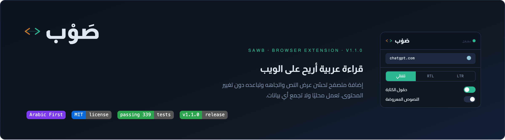
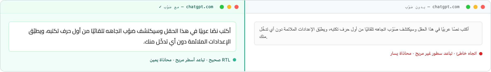
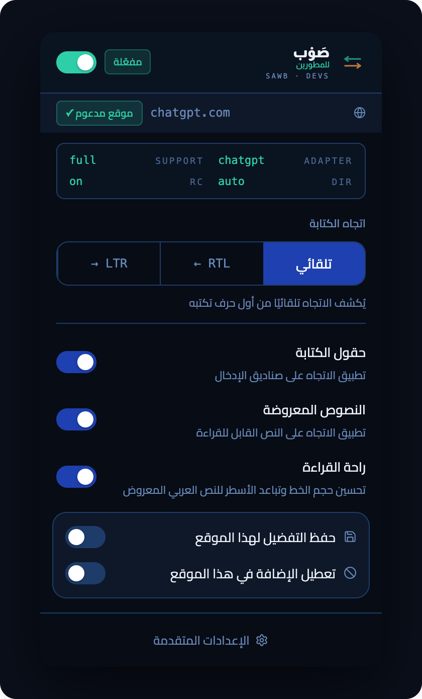
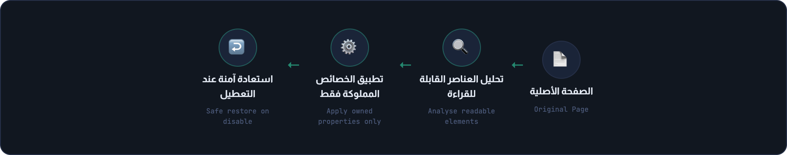
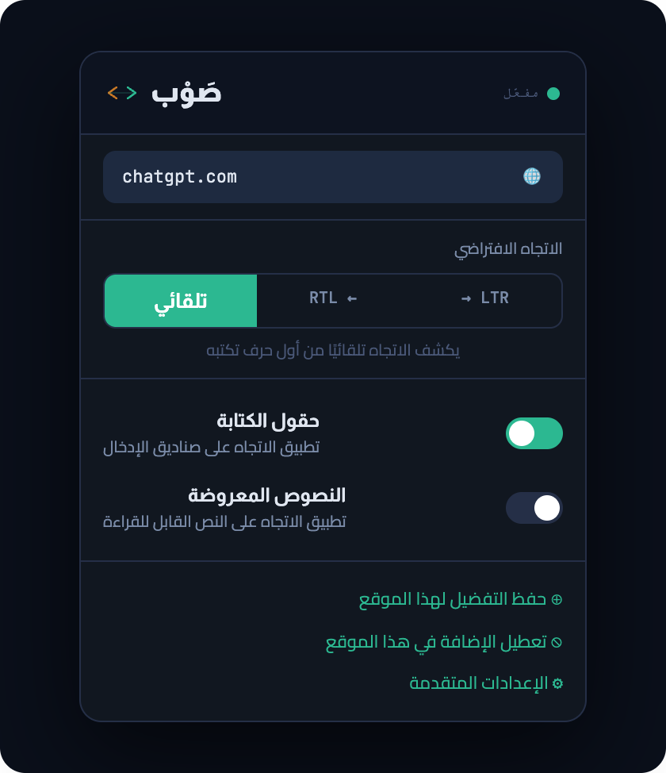

<div dir="rtl" align="center">

# صَوْب · SAWB

**قراءة عربية أريح على الويب**

إضافة متصفح تحسّن عرض النص واتجاهه وتباعده دون تغيير المحتوى — تعمل محليًا بالكامل، بلا حساب أو خادم.



</div>

<div dir="rtl">

## ما هي صَوْب؟

صَوْب إضافة متصفح مجانية ومفتوحة المصدر تحسّن تجربة القراءة العربية على الويب. تكتشف الاتجاه تلقائيًا من أول حرف تكتبه، وتضبط تباعد الأسطر والمحاذاة دون المساس بتصميم الموقع أو محتواه.

| 📖 راحة القراءة | 🎨 احترام تصميم الموقع | 🔒 العمل محليًا |
|---|---|---|
| اتجاه صحيح، تباعد أسطر مريح، ومحاذاة ملائمة لكل عنصر نصي. | نموذج ملكية CSS يضمن عدم الكتابة فوق تعديلات الموقع نفسه. | لا جمع بيانات، لا تحليلات، لا اتصال خارجي. كل شيء داخل المتصفح. |

---

## قبل / بعد

الفرق الذي تصنعه صَوْب على موقع يعرض النص العربي دون ضبط مسبق:



---

## الميزات الأساسية

| | الميزة | التفصيل |
|:---:|---|---|
| ✓ | تحسين اتجاه النص العربي | يكتشف RTL/LTR تلقائيًا أو يطبّق التفضيل اليدوي |
| ✓ | ضبط حجم الخط وتباعد الأسطر | قيم مدروسة لراحة القراءة العربية |
| ✓ | نموذج ملكية CSS | كل خاصية لها مالك: SAWB أو HOST — لا تعارض |
| ✓ | استعادة آمنة عند التعطيل | يعيد الصفحة إلى حالتها الأصلية بالكامل |
| ✓ | دعم الهياكل المتداخلة | يتعامل مع الجذور المتداخلة دون مضاعفة القيم |
| ✓ | لا تعديل على محتوى النص | يمسّ الشكل فقط، لا المحتوى أبدًا |
| ✓ | واجهة بسيطة وسريعة | نافذة منبثقة خفيفة، إعدادات واضحة |

---

## صَوْب للمطورين

وضع اختياري للتشخيص وفهم ما تطبّقه صَوْب داخل الصفحة. يُفعَّل من إعدادات الإضافة، ولا يغيّر سلوك وضع صَوْب العادي عند تعطيله.

<div align="center">

</div>

شريط التشخيص أعلى النافذة يعرض حالة الصفحة الفعلية: المحوّل النشط (ADAPTER)، مستوى الدعم (SUPPORT)، الاتجاه المطبّق (DIR)، وحالة راحة القراءة (RC).

---

## كيف تعمل؟



عند تفعيل الإضافة، تحلّل صَوْب العناصر النصية القابلة للقراءة في الصفحة وتطبّق خصائص CSS مع تسجيل ملكيتها. عند التعطيل، تزيل صَوْب الخصائص التي ما زالت تملكها، مع الحفاظ على تعديلات الموقع اللاحقة.

---

## الخصوصية

> 🔒 **صَوْب لا تجمع أي بيانات، ولا ترسل أي محتوى من الصفحات، ولا تستخدم تحليلات. كل شيء يعمل محليًا داخل متصفحك.**

| | |
|---|---|
| ❌ جمع بيانات المستخدم | ✅ تنفيذ محلي بالكامل |
| ❌ تحليلات أو تتبّع | ✅ إعدادات محفوظة محليًا فقط |
| ❌ إرسال محتوى الصفحات | ❌ خوادم خارجية |

---

## التثبيت والاستخدام

الإصدار الرسمي الحالي هو **v2.0.0**، وكل الإصدارات تُنشر في [صفحة الإصدارات](https://github.com/iSltanX/SAWB/releases) على GitHub. روابط متاجر المتصفحات ستُضاف هنا عند توفرها.

1. نزّل ملف `sawb-chromium-vX.Y.Z.zip` المرفق بأحدث إصدار، وفُك ضغطه.
2. افتح `chrome://extensions` (أو ما يقابلها في متصفحك) وفعّل **وضع المطوّر**.
3. اختر **Load unpacked** وحدد المجلد الذي يحتوي `manifest.json`.

### خطوات الاستخدام

<div align="center">

</div>

1. ثبّت الإضافة كما في الخطوات أعلاه.
2. افتح أي صفحة تحتوي نصًا عربيًا.
3. اضغط على أيقونة صَوْب في شريط الأدوات.
4. فعّل «راحة القراءة» من النافذة المنبثقة.
5. اضبط الاتجاه يدويًا أو اتركه تلقائيًا.
6. لفحص ما تطبّقه الإضافة: فعّل «صَوْب للمطورين» من الإعدادات.

---

## معلومات تقنية

### المواقع المدعومة

| الموقع | حقول الكتابة | النصوص المعروضة |
|---|:---:|:---:|
| ChatGPT | ✓ | ✓ |
| Claude | ✓ | ✓ |
| Gemini | ✓ | ✓ |
| Google AI Studio | ✓ | ✓ |
| GitHub | ✓ | ✓ |
| Substack | ✓ | ✓ |

أي موقع آخر يعمل بالوضع العام الآمن: حقول الكتابة فقط، وتفعيل النصوص المعروضة اختياري لكل موقع.

### المتصفحات المدعومة

| المتصفح | الحالة |
|---|---|
| Chrome | مختبر |
| Edge · Brave · Arc | متوافقة مبدئيًا ضمن Chromium |
| Firefox · Safari | غير مدعومة حاليًا |

صَوْب مبنية على معيار Manifest V3 لمتصفحات Chromium.

### بنية المشروع

</div>

<div dir="ltr">

```text
src/
  adapters/    # محوّلات المواقع المدعومة
  content/     # سكربت المحتوى
  core/        # محرك الاتجاه والطباعة
  platform/    # التخزين والرسائل والأنواع
  ui/          # النافذة المنبثقة وصفحة الإعدادات
tests/         # اختبارات vitest
manifest/      # ملف Manifest V3
```

</div>

<div dir="rtl">

### أوامر التطوير

</div>

<div dir="ltr">

```bash
# استنساخ المشروع
git clone https://github.com/iSltanX/SAWB.git
cd SAWB

# تثبيت الاعتماديات
npm install

# الفحص الكامل: typecheck + lint + tests + build
npm run check

# الاختبارات فقط
npm test

# بناء الإنتاج → dist/
npm run build
```

</div>

<div dir="rtl">

## الأذونات

- **`storage`** — لحفظ إعداداتك وتفضيلات المواقع محليًا في متصفحك.
- **سكربت محتوى على جميع المواقع** (`<all_urls>`) — ليعمل ضبط الاتجاه على أي موقع، بما فيها الإطارات الداخلية. لا يقرأ محتوى الصفحات ولا يرسله؛ يضبط خصائص العرض فقط ويستطيع التراجع عن كل تغيير.

هذه القائمة كاملة: لا `tabs`، لا `activeTab`، لا `scripting`.

## القيود الحالية

- نطاقات Substack المخصصة لا تُميَّز كمواقع Substack وتعمل بالوضع العام.
- المحررات المبنية على CodeMirror تُترك بلا تدخل عمدًا (محتوى محمي).
- مؤشر الاتجاه داخل الصفحات يستخدم خط النظام العربي (الخطوط المضمنة تعمل في واجهات الإضافة فقط).
- «راحة القراءة» تتطلب تفعيل «النصوص المعروضة» — مع إيقافها يبقى الطلب محفوظًا دون تطبيق.
- وضع المطورين الحالي يوفر شريط تشخيص موجزًا (ADAPTER / SUPPORT / DIR / RC) ولا يتضمن لوحة فحص تفصيلية للعناصر.
- تفاصيل أدق في ملاحظات الصيانة داخل [docs/BROWSER-READINESS.md](docs/BROWSER-READINESS.md) و[docs/CLAUDE-DOM-INSPECTION.md](docs/CLAUDE-DOM-INSPECTION.md).

## الرخصة

هذا المشروع مرخَّص برخصة [MIT](LICENSE). الأصول المضمنة من أطراف ثالثة — خطا Cairo وAlmarai (SIL OFL 1.1) وأشكال أيقونات lucide (ISC) — موثقة في [THIRD_PARTY_NOTICES.md](THIRD_PARTY_NOTICES.md).

</div>

---

<p align="center">
  <picture>
    <source media="(prefers-color-scheme: dark)" srcset="docs/assets/brand/sultan_calligraphy-dark.svg">
    
  </picture>
</p>

<p align="center" dir="rtl"><b>تصميم وبرمجة سلطان</b><br>By Sultan · <a href="https://github.com/iSltanX">github.com/iSltanX</a><br>للتواصل: <a href="mailto:iSultanby@gmail.com">iSultanby@gmail.com</a></p>

<p align="center"><code>MIT License</code> · <code>v2.0.0</code> · <code>صَوْب · SAWB</code></p>
